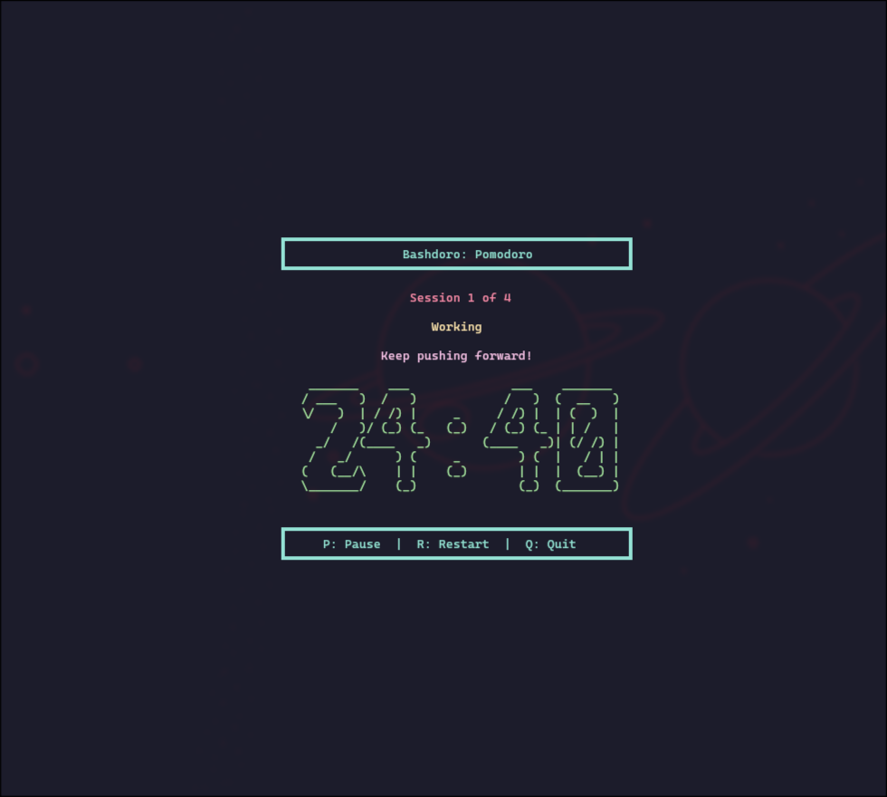

# Bashdoro: A CLI Pomodoro

**Bashdoro** a command-line Pomodoro timer 

## Controls:
  - `p/P`: Pause/resume
  - `r/R`: Restart session
  - `q/Q`: Quit
- **Custom Durations**: 25/5, 50/10, or custom.
- **Sound Alerts**: 5 beeps (work), 3 beeps (break).
- **Test Mode**: 1-minute sessions (`--test`).

## Requirements

- **Dependencies**:
  - `figlet` (`sudo pacman -S figlet`)
  - `tput` (usually pre-installed).

## Installation

1. Save the script:
   ```bash
   nano pomodoro.sh
   ```
   Paste the script and save or clone the repo.
2. Make it executable:
   ```bash
   chmod +x pomodoro.sh
   ```
   
## Usage

- Normal mode:
  ```bash
  ./pomodoro.sh
  ```
- Test mode:
  ```bash
  ./pomodoro.sh --test
  ```

## Controls

- During the timer:
  - `p/P`: Pause/resume
  - `r/R`: Restart session
  - `q/Q`: Quit
- Ignores unintended keys.

## Custom Fonts

- Default timer font: `banner.flf`
- Default message font: `big.flf`
- List available fonts:
  ```bash
  ls /usr/share/figlet/*.flf
  ```
- Test a font:
  ```bash
  figlet -f doom "00 : 00"
  ```
- Install more fonts:
  ```bash
  yay -S figlet-fonts
  ```
  or download from [fonts](https://github.com/xero/figlet-fonts)

## Changing Fonts

- Edit timer font in the script:
  ```bash
  local ascii=$(figlet -f doom "$(echo "$time_str" | sed 's/:/ : /')")
  ```
- Edit message font:
  ```bash
  print_centered "$(figlet -f small "$msg")" "$CYAN"
  ```

## Screenshots

Example of Bashdoro running in the terminal with epic.flf font:



---

Enjoy your Pomodoro sessions! 🍅
